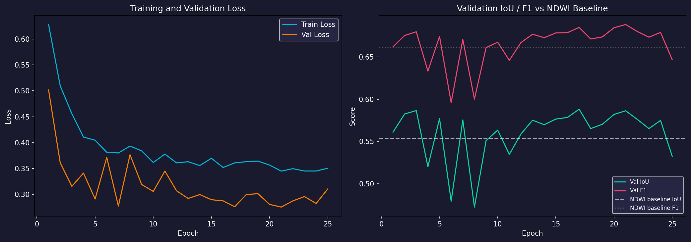
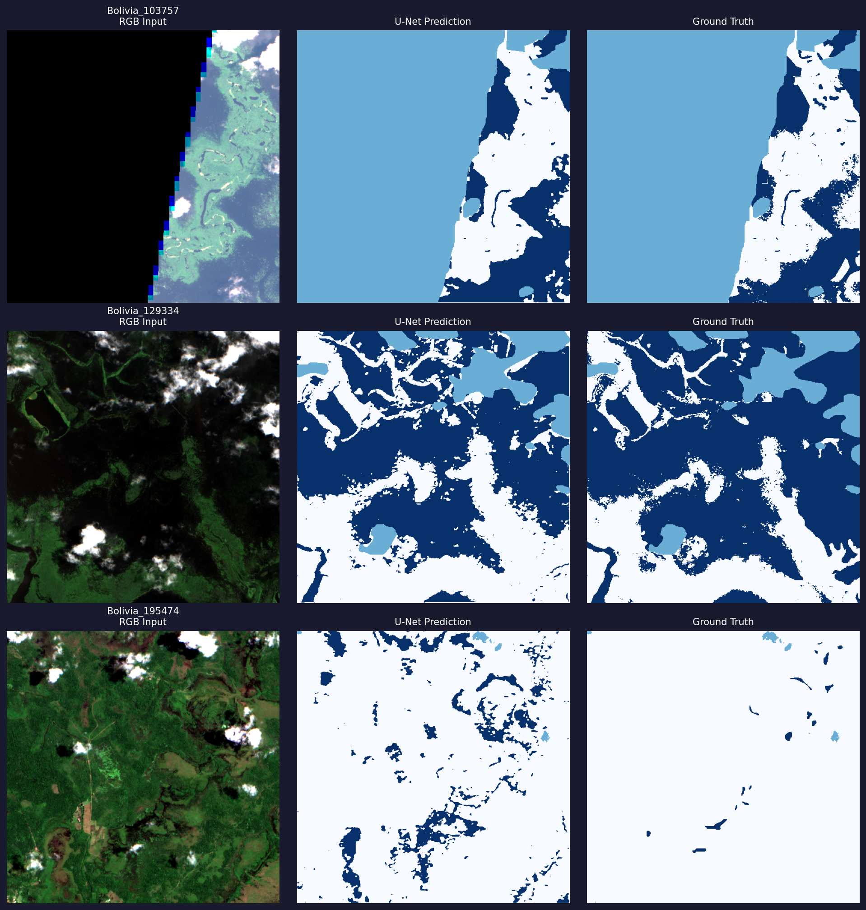
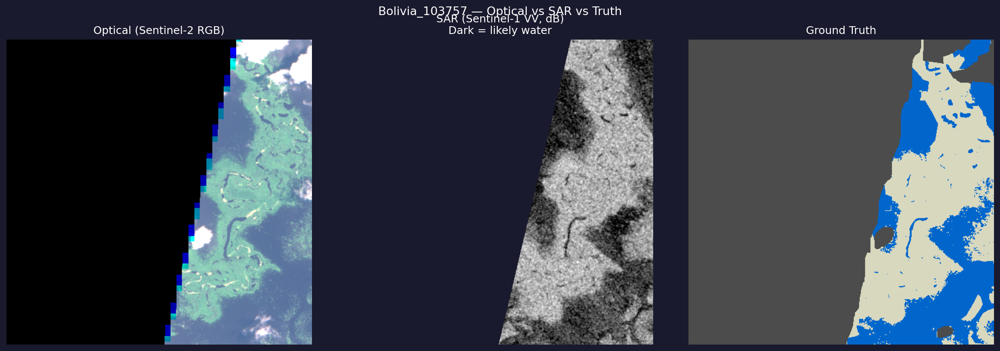
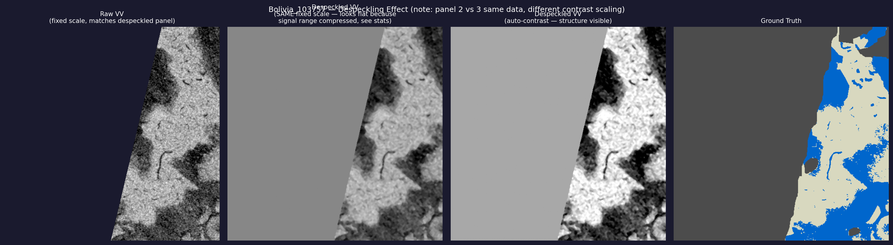

# Flood Extent Detection from Sentinel-2 Satellite Imagery

An investigation into whether a deep learning model can outperform a simple physics-based spectral index for mapping flood extent from optical satellite imagery — and what happens when training data spans limited geography.

## Problem

Rapid, accurate flood-extent mapping from satellite imagery supports disaster response, but many operational systems still rely on simple spectral thresholds. This project investigates whether a modern segmentation model (U-Net) can improve on that approach, and honestly reports what actually happened when it was tested on unseen locations.

## Motivation

Disaster risk reduction using Earth observation and AI is an active area of interest for remote-sensing agencies. This project was built as a self-directed, evidence-based investigation into that space, using public satellite data and a fully reproducible pipeline.

## Research Question

Does a U-Net trained end-to-end on Sentinel-2 imagery generalize better to *unseen* flood events than a physics-based index (NDWI), when the training dataset spans a limited number of distinct geographic events?

## Key Finding

**No — not with this amount of training data.** NDWI, a simple two-band spectral formula, outperformed the trained U-Net on held-out flood events by a substantial margin (IoU ~0.55 vs ~0.36-0.38, F1 ~0.66 vs ~0.45-0.48, evaluated on the identical 111 test chips containing flood water). A threshold-tuning experiment ruled out simple miscalibration as the cause — the model's validation performance did not transfer to test data, indicating the model learned event-specific visual patterns rather than generalizable flood-water spectral behavior. **This finding reproduced across two independent training runs** with different random initialization, increasing confidence it reflects a real effect of limited training-event diversity (11 total flood events) rather than one unlucky run.

## Dataset

[Sen1Floods11](https://github.com/cloudtostreet/Sen1Floods11) (Sentinel-2 hand-labeled subset) — 446 usable 512×512 image chips across 11 flood events globally, with per-pixel binary flood/non-flood labels. (An earlier partial download undercounted this at 394; the test set itself — Bolivia/Ghana/USA, 137 chips — was unaffected and identical across all reported runs, since the event-level split is independent of total chip count.)

## Method

1. **Baseline:** NDWI = (Green − NIR)/(Green + NIR), computed from Sentinel-2 bands B3 and B8. Threshold swept from −0.30 to +0.55; best threshold −0.10 (F1 0.629, IoU 0.525 across all chips).
2. **Split:** Performed at the **flood-event level**, not chip level, to prevent geographic leakage — all chips from one event land entirely in train, validation, or test.
3. **Model:** U-Net from scratch (~7.8M parameters), 4 input channels (Blue/Green/Red/NIR), combined BCE + Dice loss to handle class imbalance, 25 epochs, seed fixed for reproducibility.
4. **Evaluation:** Test set (Bolivia, Ghana, USA — 137 chips) never touched during training or model selection. Metrics computed by accumulating true/false positives/negatives across all test pixels, not by averaging per-chip ratios.

## Results

*Validation IoU/F1 tracked against the NDWI baseline across 25 training epochs.*

*U-Net predictions vs ground truth on three held-out test chips.*

| Comparison | IoU | F1 |
|---|---|---|
| NDWI baseline (111 flood-containing test chips) | **0.554** | **0.661** |
| U-Net, Run 1 (default threshold 0.5) | 0.356 | 0.452 |
| U-Net, Run 1 (validation-tuned threshold) | 0.355 | 0.524 |
| U-Net, Run 2 — independent rerun (default threshold 0.5) | 0.375 | 0.483 |
| U-Net, Run 3 — independent rerun (default threshold 0.5) | 0.345 | 0.445 |

Three independent training runs (different random initialization, same seed and architecture) produced consistent results — NDWI outperforms U-Net by a stable margin of roughly 0.19-0.21 in both IoU and F1 across all three runs.

Per-event breakdown, per-chip false-positive analysis, and the full threshold-sweep tables are in [`EVALUATION_AUDIT.md`](./EVALUATION_AUDIT.md).

## Error Analysis

- U-Net's recall on flood-containing chips was reasonable (0.64–0.77) — it does detect flood water — but precision was weak, producing false positives that eroded IoU/F1.
- All 26 zero-flood test chips came from a single event (Ghana); 20 of them triggered mild flood hallucination (mean 5.85% of image area falsely flagged), suggesting the model partially confused certain dry/bare-soil textures with flood water it hadn't seen during training.
- Performance varied by event (Bolivia IoU 0.46, Ghana 0.19–0.38, USA 0.32), consistent with event-specific overfitting rather than uniform weakness.

## Limitations

- Only 11 flood events total; train/validation/test splits necessarily cover very few distinct geographies.
- No hyperparameter search beyond the single reported threshold sweep and one architecture configuration.
- Results are specific to this dataset and are not claimed to generalize to other sensors (e.g., SAR) or to India-specific flood geography, which was not represented in the training data.

## SAR Extension (Sentinel-1)

*Same location viewed in optical (left), raw SAR VV backscatter (center), and ground truth (right). Water appears dark in SAR due to specular reflection away from the sensor.*

*Raw vs despeckled SAR backscatter at matched and auto-contrast scales. Despeckling narrows the pixel value spread (visible structure, reduced grain) but only yields a modest metric improvement — see discussion below.*

Beyond the optical analysis above, Sentinel-1 SAR backscatter (VV polarization) was evaluated as a second, independent sensing modality on the same test chips, since SAR penetrates cloud cover and is operationally important for disaster response.

| Method | IoU | F1 |
|---|---|---|
| NDWI (optical, tuned) | 0.554 | 0.661 |
| SAR VV, raw threshold | 0.230 | 0.328 |
| SAR VV, despeckled (5×5 median filter) | 0.244 | 0.332 |
| U-Net (optical) | ~0.36-0.39 | ~0.46-0.49 |

SAR underperformed optical methods here. A literature review clarified why: published SAR flood-mapping methods typically (1) despeckle before thresholding — adding this step improved results modestly, consistent with the literature — and (2) use multi-temporal change detection (before/after-flood image comparison) rather than a single absolute threshold, since "normal" backscatter varies by land cover and location. This project used only a single-image absolute threshold, the simplest and weakest standard SAR technique, which is assessed as the main reason for the gap — not evidence that SAR is fundamentally less suited to flood mapping. Full methodology, a caught-and-fixed NaN data-quality bug, and literature citations are documented in [`EVALUATION_AUDIT.md`](./EVALUATION_AUDIT.md).

## Future Work

- Train on a larger, more geographically diverse flood dataset before drawing conclusions about deep learning's general viability for this task.
- Explore transfer learning from a pretrained EO encoder rather than training U-Net from scratch.
- Add hard-negative training on dry/arid chips resembling the Ghana false-positive cases.
- Implement multi-temporal SAR change detection (before/after-flood comparison) rather than single-image absolute thresholding, following standard practice in published SAR flood-mapping methodology.
- Apply edge-preserving despeckling filters (Refined-Lee, Lee-Sigma) in place of the simple median filter used here, which the literature suggests would yield larger gains.
- Combine optical and SAR predictions (e.g., as model input channels, or via ensembling) rather than evaluating each sensor independently.

## Reproducibility

Seed fixed at 42 across Python/NumPy/PyTorch/CUDA. Full notebook available in this repository: [`flood-detection-eo-v2.ipynb`](./flood-detection-eo-v2.ipynb). Event-level train/val/test split verified programmatically disjoint. Best model checkpoint and all evaluation code included.

## Engineering Details

Built and trained on Kaggle Notebooks (free GPU tier, NVIDIA T4×2) due to local hardware constraints (no local GPU). Data loaded directly from the public Sen1Floods11 Google Cloud Storage bucket — no manual upload required.
